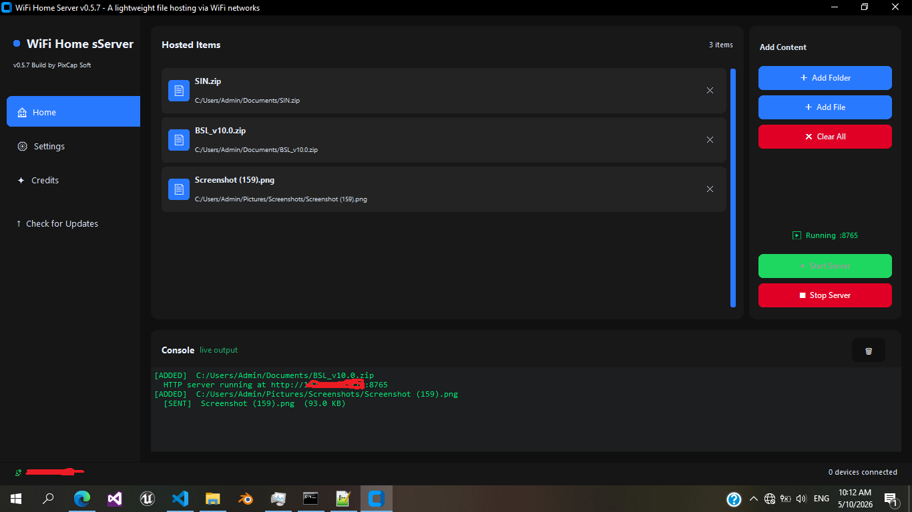
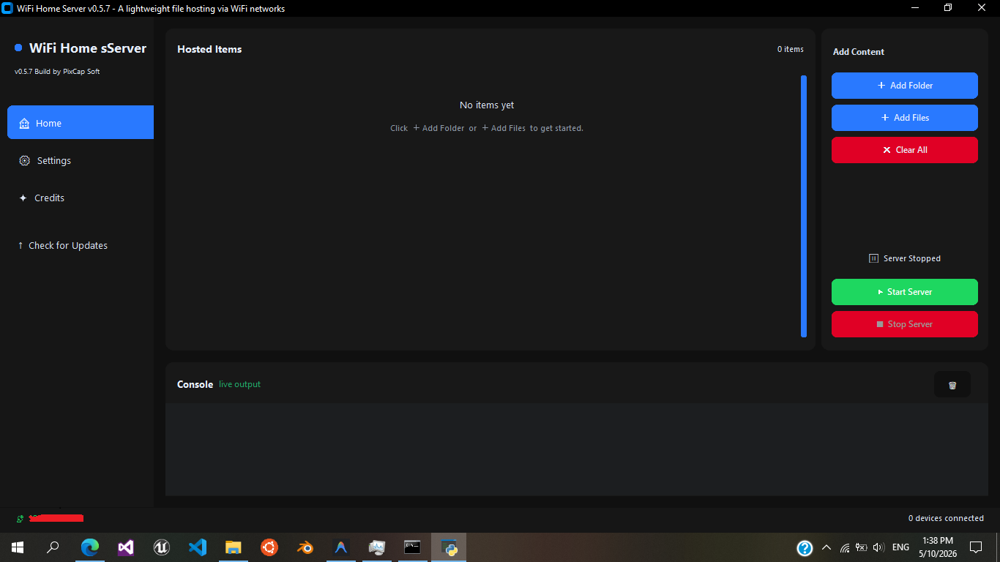
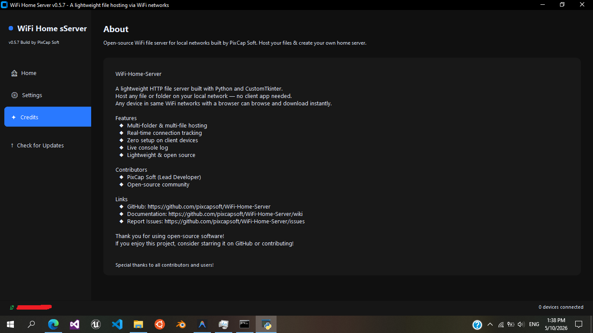

# 📡 WiFi Home Server

<div align="center">
  
  
  
  
  
</div>

<br>

A lightweight, minimal, and beautiful HTTP file server built with **Python** and **CustomTkinter**. With WiFi Home Server, you can host local files and folders over your WiFi network, allowing any device on the same network to browse and download them instantly via their web browser.

No ADB, no USB, and no client-side app needed! ✨

## ✨ Features

- **🚀 Zero Client Setup**: Access shared files from any web browser on the same network.
- **📁 Multi-Directory Hosting**: Select multiple individual files or entire folders to host simultaneously.
- **📱 Real-time Tracking**: Monitor active connections in real-time.
- **🖥️ Beautiful UI**: A modern dark-themed GUI designed with an electric blue accent.
- **📜 Live Console Log**: Track server requests, errors, and system activity directly from the app.
- **🛠️ Standalone**: Optionally run purely from the CLI using `main.py` without the GUI overhead.

---

## 📸 Screenshotss

> **Home Panel** showing the list of hosted items and server controls.



> **Console Panel** displaying live connection logs.

---

## 🛠️ Installation & Usage

### 🚀 Quick Start (No Python Required)
You don't need Python installed to use WiFi Home Server! Just download the pre-built executable:

1. Go to the [Releases](https://github.com/pixcapsoft/WiFi-Home-Server/releases/latest) page.
2. Download the latest executable file.
3. Run the downloaded file—it works completely out of the box!

---

## 💻 Build from Source

If you prefer to run the application from the source code, follow these steps:

### Prerequisites
- Python 3.11 or newer
- `customtkinter` package

### Setup

1. **Clone the repository:**
   ```bash
   git clone https://github.com/pixcapsoft/WiFi-Home-Server.git
   cd WiFi-Home-Server
   ```

2. **Install the dependencies:**
   ```bash
   pip install customtkinter
   ```

### Running the App

To launch the beautiful graphical user interface:

```bash
python gui.py
```

To run the server purely from the command line:
1. Open `main.py` and modify the `shared` list at the bottom to configure your hosted folders.
2. Run the script:
   ```bash
   python main.py
   ```

---

## 🌐 How your devices connect

1. Start the server via `gui.py` (Add folders/files, and click **Start Server**).
2. Look at the bottom left of your app to see your local IP (e.g., `📡 192.168.1.100`).
3. Take your phone, tablet, or another laptop on the same WiFi network and open the browser.
4. Type `http://192.168.1.100:8765` into the URL bar and hit Go.
5. Browse and download your files directly!

---

## 🛡️ Security & Privacy

Since WiFi Home Server binds your server to `0.0.0.0`, **anyone on your local WiFi network** can access the files you have explicitly shared. 
For more essential security guidelines, please see the [SECURITY.md](SECURITY.md) file.

---

## 🤝 Contributing

We love contributions! Whether you're fixing bugs, adding new features, or improving documentation, your help is welcome.
Please check out our [Contributing Guidelines](CONTRIBUTING.md) to get started.

---

## 📄 License

This project is open-source and available under the terms of the [Apache License 2.0](LICENSE).

<div align="center">
  <sub>Built with ❤️ by PixCap Soft and the Open Source Community</sub>
</div>
